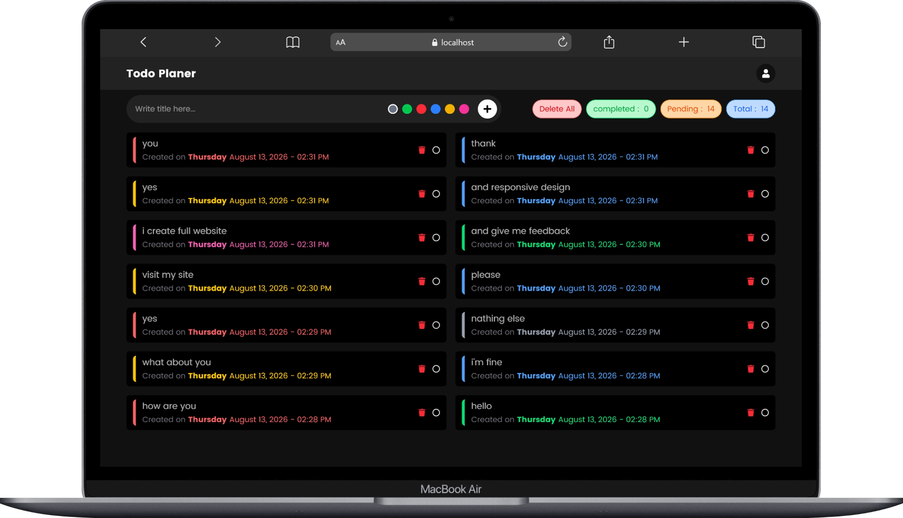
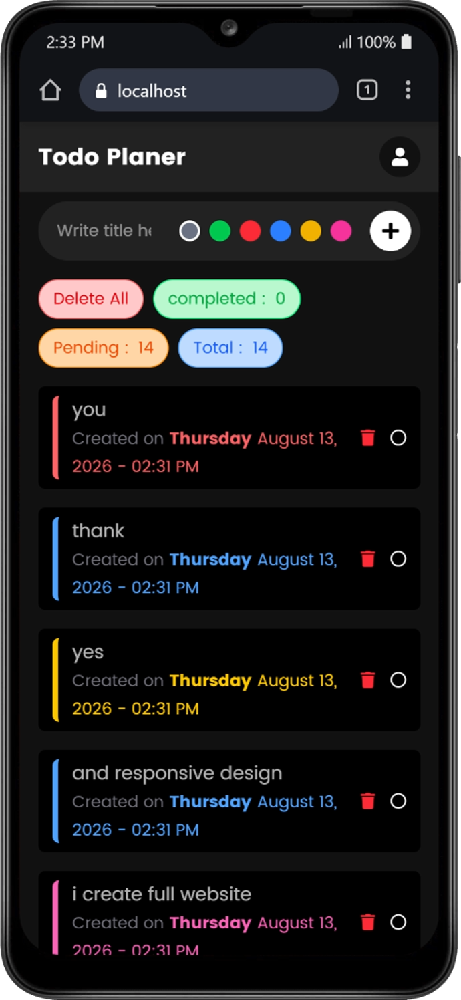

# 📖 Task Manager

_i create fully functinal modern responsive task management project using mern stack_.

---

## Table of Contents

- <a href='#overview'>Overview</a>
- <a href='#tech'>Tech Stack & Packages</a>
- <a href='#featured'>Featured</a>
- <a href='#author'>Author</a>
- <a href='#img'>Images</a>

---

 <h2><a class='anchor' id='overview'>Overview :</a></h2>
i create fully functinal modern responsive task management project using mern stack

---

<h2><a class='anchor' id='tech'>Tech Stack & Packages :</a>
</h2>

- 🔥 REACTJS
- 🔥 NODEJS
- 🔥 EXPRESSJS
- 🔥 MONGODB
- 🔥 TAILWINDCSS
- 🔥 AXIOS

---

<h2><a class='anchor' id='featured'>Featured :</a></h2>

- ➡️ fully working task manager,
- ➡️ fully crud operation,
- ➡️ Total number,

---

<h2><a class='anchor' id='author'>Author :</a></h2>

- 👤 Anish Rathod
- 💻 MERN Stack Developer
- 📞 +91 6353191430
- 📧 anishdeveloper100@gmail.com
- 📧 anishr6353@gmail.com
- 🔗 https://www.linkedin.com/in/anishrathod123/ (linkedin)
- 🔗 https://github.com/anishrathod100 (github)

<h2><a class='anchor' id='img'>Images :</a></h2>

1. Desktop

---

2. Responsive

